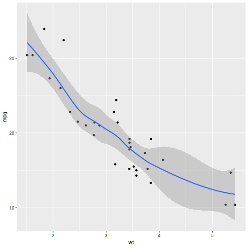

========================================================
Reproducible research using minimalist plain text tools
========================================================

Introduction
-------------

For many studies particularly in Epidemiology and health sciences, a full replication is impossible to attain for a number of reasons includng logistics and time constraints. For example, in case of large cohort studies, where data are accumulated over many years, attainment of complete replication is impossible and expensive. However, it is also important that the results from these studies be verifiable or results be repeatable. If full replication of the study by replicating the study methods in a comparable sample is not possible, a reasonable compromise therefore is that, given the original data, are the results reproducible using different methods of analyses keeping the goals of analyses same? If the results are reproducible using the methods and analyses conducted by those who conducted the study in the first place, this allows for greater emphasis on the study findings given the difficulty or impossibility of full replication of such studies. Besides, for large studies, if the data are made available, it allows for diverse analyses and discovery. 

Reproducible research in health sciences requires data be made available, and often in the absence of data being made available, full reproducibility is not possible. Roger Peng(2011) summarising the state of the art of reproducible research identified two critical barriers: (1) limited availability of computational data or raw data on which analses can be conducted, and (2) an infrastructure that wouuld allow dissemination of the data and the codes freely so that everyone can reproduce the results [peng2011]_. 

As Internet access is now nearly ubiquitous and the computational speeds keep increasing, it is possible to conduct desktop reproducible experiments. An impediment in the process there is the complexity of the workflows and tools. Can we use free tools that are openly accessible and be made available to as many researchers as possible without barriers? Several such tools exist and the software and a reasonable amount of storage are also made available for free. 

The statistical computing envrionment `R <http://www.r-project.org>`_ with its ecosystem of packages has made the barrier of analyses of data to be low. As long as the data are available in a readable format such as plain text comma separated value files and in the form of spreadsheets or tidy data (see Wickham [wickham2014]_ for a detailed discussion about tidy data), such data should be open to analyses given the goals of the researchers. As for the ecosystem of distribution, using free and open source repositories such as git and `github <https://www.github.com>`_ have made it possible to distribute texts of analyses and data and codes almost freely to everyone who wants to analyse such data sets. There are many more version control distribution systems besides github including bitbucket, gitlab, and others that serve the same purpose. Besides, large funding agencies such as the Gates Foundation and the National Institutes of Health in the United States require that research supported by these foundations should make data for others. For more information, see `Gates Foundation Notes on data sharing <https://www.gatesfoundation.org/How-We-Work/General-Information/Information-Sharing-Approach>`_, and `NIH policy on data sharing <https://grants.nih.gov/policy/sharing.htm>`_. 

A critical barrier here is much less about free availability of data sets, but while considering what possible barriers exist about dissemination of reproducible data freely among researcher communities is about complexity of the management and dissemination. Researchers who rely on proprietary authoring and data analytical software may be constrained by the requirements of usage of such software and then, if anyone wants to reproduce the results using those software would need to use the specific software used for the data analyses. These therefore do not always allow for freedom of workflow that can be achieved by using plain text workflow formats. For example commercial applications and closed source software impose restrictions that many people cannot use them freely. On the other hand, while plain text based typesetting solutions such as Latex allow the freedom and simplicity of writing ubiquitously, they have the problem of being complex to use. As a result, even though latex authoring tools such as `Overleaf <http://www.overleaf.com>`_ are available and offer wysiwyg facilities to write text, the complexity of using latex may have made some academics skeptic to use latex as a medium of writing. As an alternative, markdown text writing format is a viable alternative to write on the web with features that make reading text on the web browser easy, but for academic usage, the natively supported markdown format features are limited, as markdown in its native format does not support table and citations that are essential for an academic to write arguments and present data. 

The software converter suite `Pandoc <http://pandoc.org>`_ is touted as a "swiss army knife" of tools and provides converters to convert Markdown and enables academic documents to be written in Markdown format, but it also requires that the authors of such markdown format be familiar with document meta-data and use specific markers to post document meta-data and write the text in a way that would make it publishable. So while using R and markdown is a good alternative where one can use plain text weaving codes and documentation to produce academic documentation, one would still need to be able to use document meta-data in the right places (at the top of the document with the right kind of syntax) to make this work. This is again, not very intuitive for many people even though one can argue that the process itself makes for robust presentation. Thus, there is no easy way out where one can use plain text to write code and documentation, then add plain text data format in comma separated value based tidy data format, and package it to disseminate as widely as possible and in as many formats as possible, keeping a tight version control. 

Possible solutions
-------------------

Thus while the solutions for reproducible research using plain text based writing, analyses, dissemination, and authoring of papers are available, none of them are so easy to use that a counter-culture of reproducibility being the norm can be easily established. As Peng (2011) observed and Stodden et.al. (2013) noted in their discussion paper [stodden2013]_, old habits die hard. Arguably, a combination of easy to use, ubiquitous, free set of tools can make it easy for people with some resistance to change to ease into a mindset where free and open dissemination of data and codes to make reproducible research possible. Writing in plain text, as happens in an email communication, can facilitate this process. 

In the context of plain text, `asciidoc <http://www.asciidoctor.org>`_ and `restructuredtext format <http://docutils.sourceforge.net/rst.html>`_ provide two such opportunities. Both of these writing styles are used for software documentation quite widely and they offer suites of markups for tables, citations, and other elements that are intuitive to compose and they are also extensible and can be converted to html and latex without any need to learn too much markup. So, while the learning curve is relatively flatter compared with learning something like html/latex/academic markdown, use of these tools also offer for integration with R and Python, the two open source, freely available software suites that allow for data analysis and graphing. 

Rise of weavers
-----------------

The statistical programming environmnt R has an ecosystem of modules and packages; while one can start with a base R system with limited set of packages, one can rapidly expand the capability of R statistical data analysis using packages either by downloading the packages from repositories maintained by academics and others who are R users; or one can write one's own package. One of these packages would enable weaving codes and free text on the document where one is writing R codes. Thus technical documentation and R codes can be kept separate, yet at the time of compilation of code, R can be run on the code part of the document leaving the documentation untouched. This in turn results in a new document that has the outputs of the code and the results (i.e., the tables and figures) woven with the documentation itself. In case of R, this package is "knitr", authored by Yihui Xie (for more information, see [Xie2013]_ for more information). So it is quite possible to download data from the repo where the data are maintained, analyse them using R, then weave and write the report in the same document providing all the code that were used to create the results and the table and thus in one package, it would be possible to embed the codes and results while providing a link to the data. This would create one source document that would enable anyone to re-analyse and reproduce the results of any study and examine the code that was used to conduct the data analyses. Further, if the data were to be disseminated with version control systems such as github or bitbucket, then a publicly available set of data and associated reports with results are made open for examination. 

Methods and Results
--------------------

In this paper, we argue that it is possible to document, share, and analyse data using R and a simple text editor, and free, open-source software that are installed in an operating system. We will use Rstudio as a text editor. We will pretend that we will use the dataset mtcars to read data, process using tidy analyses, construct graphs, conduct tables, and output using R analyses and finally weave the text. We will keep R code and report writing separate but connected. So this document will contain the text and outputs of the R codes. The documented R codes will be run separately first and the code will then be copied and pasted here, or referenced here. This will be possible using a knitting function referred to as knitr. In future, with only tweaking of the part of the R code and rernunning knitr on the document will update the analyses or change the analyses. 

This document will live inside a git repository and we are writing this in plain text. You can reproduce the article's data analyses entirely using the codes we present here, and you can obtain a copy of the data freely using the R software. Thus, this article itself is a fully documented reproducible research piece written entirely in plain text using restructuredtext format. It could be re-written using the asciidoc format, which is slightly more intuitive and closer to how we write emails in plain text for instance. Be that as it may, we'd like to write a longish article formatted document, add statistical data analysis and figures and add citations and references directly from the Internet. This is a demonstration paper to htat effect. 

We argue that any such paper will allow us to write and insert the following elements without friction or taking special steps as we write. These elements are as follows:

- Free text and paragraphs
- Bulleted lists
- Numbered lists
- Tables of information, particularly for data driven documents
- Citations and referencing
- images and graphs
- Embed analyses in the same paper

Analysis of data
-----------------------

1. Introduce the code block using R syntax
2. Insert R code chunks
3. Then run the codes. 

We recommend that R codes are first run and only those codes that are relevant to the complete analyses (data cleaning, modelling, table and graph generation are placed with comments in the code sections. This is done along with options to either turn off the code showing up in the final paper but still be made available in raw text format in the source document to enable reproducibility without sacrificing readability of the paper)

.. sourcecode:: r
    

    library(tidyverse)
    library(knitr)
    
    data(mtcars)
    
    # Create a subset of six variables and tabulate them
    
    mtcars %>%
      select(mpg:wt) %>%
      head() %>%
      kable()

=================  ====  ===  ====  ===  ====  =====
\                   mpg  cyl  disp   hp  drat     wt
=================  ====  ===  ====  ===  ====  =====
Mazda RX4          21.0    6   160  110  3.90  2.620
Mazda RX4 Wag      21.0    6   160  110  3.90  2.875
Datsun 710         22.8    4   108   93  3.85  2.320
Hornet 4 Drive     21.4    6   258  110  3.08  3.215
Hornet Sportabout  18.7    8   360  175  3.15  3.440
Valiant            18.1    6   225  105  2.76  3.460
=================  ====  ===  ====  ===  ====  =====

.. sourcecode:: r
    

    # Graph the relationship between wt and mpg
    
    mtcars %>%
      ggplot() +
      geom_point(aes(x = wt, y = mpg)) +
      geom_smooth(aes(x = wt, y = mpg))

::

    ## `geom_smooth()` using method = 'loess' and formula 'y ~ x'

    Plot of mpg versus weight
.. sourcecode:: r
    

    ## run regression of mpg on wt and get a table of coefficients
    
    wt_mpg <- lm(mpg ~ wt, data = mtcars)
    kable(coef(summary(wt_mpg)))

===========  =========  ==========  =========  ========
\             Estimate  Std. Error    t value  Pr(>|t|)
===========  =========  ==========  =========  ========
(Intercept)  37.285126    1.877627  19.857575         0
wt           -5.344472    0.559101  -9.559044         0
===========  =========  ==========  =========  ========

Conclusions and next steps
---------------------------

In the above, we have included a code block within the document. In the code block, we have read a data set, we plotted graphs, we subsetted the data set, and programmatically created the tables. We have left the codes for the reader to examine; if that was not the intention, we could have indicated to hide the code elements, and continued with the output of figures and tables. We have also seamlessly continued to write the paper using citations and references from reference managers and reading directly off the webpages such as `Google Scholar <http://scholar.google.com>`_. These steps have provided us a way to write a paper in plain text and sharing the data, the codes, and the text without invoking proprietary software and special procedures. However, the end results of this process can be viewed in the web as webpage directly by accessing the github repository or converting the document to latex and pushing the latex document to web based services such as Overleaf for further publishing. It is also possible to push the results of the study to preprint servers for furhter critique and comments before the study can be considered for publishing.  

In order to publish this paper as a plain text document that is also readable but without the images (as images are kept as separate files and indicated on the document where they are placed), one needs to run the R code ``knit`` on the document. This will create a knitted file. If the file needs to be updated dynamically, the the code elements can be modified to reflect the changes. Python modules and packages such as rst2html and rst2latex will convert the files to their respective html-ised vesions and latex-ified versions for production and further publishing. If the document is put using git version control system to a repository such as github that accepts restructuredtext as a valid input, then this document can be directly viewed as an html document along with the source code. Github also makes it possible to add comments to the raw file so that changes can be made. 

While this process enables one to write reproducible research using R, knitr, and restructuredtext based tools, there are other tools available that can be used as well. Rmarkdown provides a front end of writing papers and distributing them using similar procedures in Rstudio using R and markdown. However, for Rmarkdown, the author needs to insert specific meta-data into the document for inserting citations and one needs the pandoc parser to convert the rmarkdown files to their "viewable" state. Another easier, more intuitive set of markups for plain text is with asciidoc. An implementation of asciidoc, named as asciidoctor allows conversion of the markup elements to latex and html document sets but this requires installation of asciidoctor and ruby programming language and gems in the system. A third way of using the restructuredtext is to use a software referred to as sphinx. Sphinx is based on python and has been used for writing software documentation. Sphinx when installed and invoked using terminal based command sphinx-quickstart, generates a set of folders and files which can be populated and its configuration file can be adjusted to write different kinds of documents including tutorials, documentations, books, and theses, including journal articles but this requires advanced knowledge about programming and tools. 

`Jupyter notebooks <http://jupyter.org>`_ provide interactive notebooks where one can use the markdown language to write text and documentation and code in different languages to perform data analyses, then mix code and documentation. However, while Jupyter notebooks are intuitive and allow for writing codes in different langauges and weave codes and documentation, some citation support in Jupyter notebooks is possible using bibtex and pandoc flavoured markdown using bibtex; however the process of setting up the citation support is not easy and can be challenging to set up for people who want to quickly get up to speed and write papers and not worry about citation formatting. `Stencila <http://stenci.la>`_ is similar to Jupyter notebooks as a stand-alone software that allows for mixing code and data together in one framework and allows for mixing code and documentation in R, python and javascript to conduct data analyses. It also has integrated support for citations and dynamic documentation and analyses generation. But stencila documents are not convertible to other formats and if one is working in a multi-author environment, each author must have a copy of stencila in his or her computer to work with it. 

Three web-based implementations allow writing and dissemination of scholarly documentations easy and intuitive. `Authorea <http://www.authorea.com>`_ allows for embedding jupyter notebooks and documentation in a multi-author wysiwyg environment and allows for publishing to other repositories and sources and minting of document object identifiers. While Authorea does not allow for embedded analyses in the writing interface, it is an intuitive web based writing tool, and allows for storing of data and analyses files. However, retrieval of the data and analyses files are not intuitive and one needs to connect Authorea document using github or similar git based tools to obtain access to the data sets and analyses files. `Overleaf <http://www.overleaf.com>`_ provides an intuitive latex based writing interface that allows storing data in the server. Overleaf is more flexible and intuitive than Authorea in the sense that it allows for direct downloading from Overleaf but one can also connect an Overleaf document to github for version control. `Qeios <http://www.qeios.com>`_ provides a rich text format to write contents but does not allow for storing of documents or data on their server. While the writing interface and direct minting of DOIs are beneficial for knowledge production and archiving, they do not allow for direct uploading of plain text documents, data, and code on their servers. However, in all these three situations, a web based writing can be combined with storing and hyperlinking of codes and data on git-based or other version control repositories.  

In conclusion, there is no single tool that is at once intuitive, easy to use, plain text based and allows for seamless weaving of data, code, and documentation in a production environment. The closest implementations are Rmarkdown, R-restructuredtext, and R-asciidoc formats, where one can write code and documentation in plain text, and then export the document to different formats using converters, keeping the data on the web to be downloaded and codes directly embedded on the file. These are also ubiquitous as long as software such as R and Python or Ruby are installed in the base system or on the server. Jupyter Notebooks and Stencila and clones are next best implementations as they provide a more or less seamless integration of data, code, and documentation, but each has its own level of complexity to configure and not the most intuitive tool to use. Overleaf, Authorea, and Qeios provide three different web based environments to write documentation but not much code and on-the-fly analyses and tables can be generated on these platforms. the search for a plain text tool that is at once so intuitive that one can just start a plain text editor to write code and documentation, then run and directly export to multiple publishable formats easily will continue meanwhile.

References
-----------

.. [peng2011] Peng, R. D. (2011). Reproducible Research in Computational Science. Science, 334(6060), 1226–1227. https://doi.org/10.1126/science.1213847
.. [wickham2014] Wickham, H. (2014). Tidy data. Journal of Statistical Software, 59(10), 1-23.
.. [xie2013] Xie, Y. (2013). knitr: A general-purpose tool for dynamic report generation in R. R package version, 1(1).
.. [stodden2013] Stodden, V., Borwein, J., & Bailey, D. H. (2013). Setting the default to reproducible. computational science research. SIAM News, 46(5), 4-6.